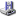

|           图标名称                     |                                                    图标样式                                                  |
|---------------------------------------|--------------------------------------------------------------------------------------------------------------|
| SP_ArrowBack                          | 
  
                                                  |
| SP_ArrowDown                          | 
  
                                                  |
| SP_ArrowForward                       | 
  
                                            |
| SP_ArrowLeft                          | 
  
                                                  |
| SP_ArrowRight                         | 
  
                                                |
| SP_ArrowUp                            | 
  
                                                      |
| SP_BrowserReload                      | 
  
                                          |
| SP_BrowserStop                        | 
  
                                              |
| SP_CommandLink                        | 
  
                                              |
| SP_ComputerIcon                       | 
  
                                            |
| SP_CustomBase                         | 
  
                                                |
| SP_DesktopIcon                        | 
  
                                              |
| SP_DialogApplyButton                  | 
  
                                  |
| SP_DialogCancelButton                 | 
  
                                |
| SP_DialogCloseButton                  | 
  
                                  |
| SP_DialogDiscardButton                | 
  
                              |
| SP_DialogHelpButton                   | 
  
                                    |
| SP_DialogNoButton                     | 
  
                                        |
| SP_DialogOkButton                     | 
  
                                        |
| SP_DialogOpenButton                   | 
  
                                    |
| SP_DialogResetButton                  | 
  
                                  |
| SP_DialogSaveButton                   | 
  
                                    |
| SP_DialogYesButton                    | 
  
                                      |
| SP_DirClosedIcon                      | 
  
                                          |
| SP_DirHomeIcon                        | 
  
                                              |
| SP_DirIcon                            | 
  
                                                      |
| SP_DirLinkIcon                        | 
  
                                              |
| SP_DirLinkOpenIcon                    | 
  
                                      |
| SP_DirOpenIcon                        | 
  
                                              |
| SP_DockWidgetCloseButton              | 
  
                          |
| SP_DriveCDIcon                        | 
  
                                              |
| SP_DriveDVDIcon                       | 
  
                                            |
| SP_DriveFDIcon                        | 
  
                                              |
| SP_DriveHDIcon                        | 
  
                                              |
| SP_DriveNetIcon                       | 
  
                                            |
| SP_FileDialogBack                     | 
  
                                        |
| SP_FileDialogContentsView             | 
  
                        |
| SP_FileDialogDetailedView             | 
  
                        |
| SP_FileDialogEnd                      | 
  
                                          |
| SP_FileDialogInfoView                 | 
  
                                |
| SP_FileDialogListView                 | 
  
                                |
| SP_FileDialogNewFolder                | 
  
                              |
| SP_FileDialogStart                    | 
  
                                      |
| SP_FileDialogToParent                 | 
  
                                |
| SP_FileIcon                           | 
  
                                                    |
| SP_FileLinkIcon                       | 
  
                                            |
| SP_LineEditClearButton                | 
  
                              |
| SP_MediaPause                         | 
  
                                                |
| SP_MediaPlay                          | 
  
                                                  |
| SP_MediaSeekBackward                  | 
  
                                  |
| SP_MediaSeekForward                   | 
  
                                    |
| SP_MediaSkipBackward                  | 
  
                                  |
| SP_MediaSkipForward                   | 
  
                                    |
| SP_MediaStop                          | 
  
                                                  |
| SP_MediaVolume                        | 
  
                                              |
| SP_MediaVolumeMuted                   | 
  
                                    |
| SP_MessageBoxCritical                 | 
  
                                |
| SP_MessageBoxInformation              | 
  
                          |
| SP_MessageBoxQuestion                 | 
  
                                |
| SP_MessageBoxWarning                  | 
  
                                  |
| SP_TitleBarCloseButton                | 
  
                              |
| SP_TitleBarContextHelpButton          | 
  
                  |
| SP_TitleBarMaxButton                  | 
  
                                  |
| SP_TitleBarMenuButton                 | 
  
                                |
| SP_TitleBarMinButton                  | 
  
                                  |
| SP_TitleBarNormalButton               | 
  
                            |
| SP_TitleBarShadeButton                | 
  
                              |
| SP_TitleBarUnshadeButton              | 
  
                          |
| SP_ToolBarHorizontalExtensionButton   | 
  
    |
| SP_ToolBarVerticalExtensionButton     | 
  
        |
| SP_TrashIcon                          | 
  
                                                  |
| SP_VistaShield                        | 
  
                                              |

