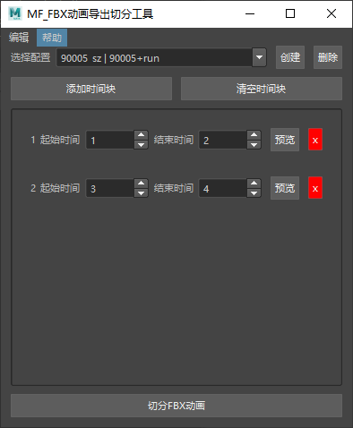
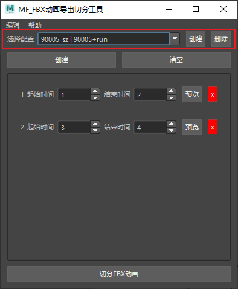
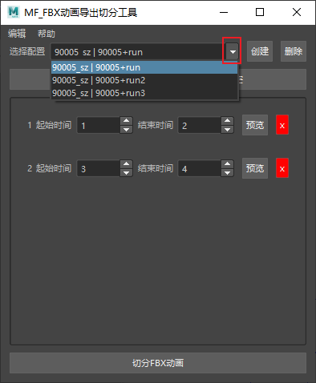
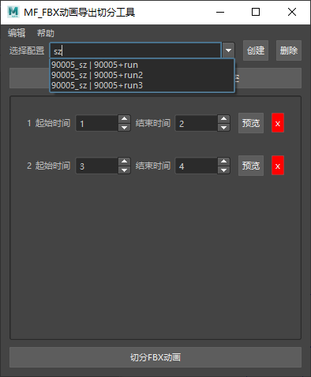
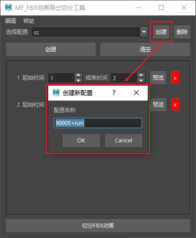
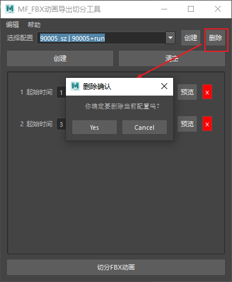
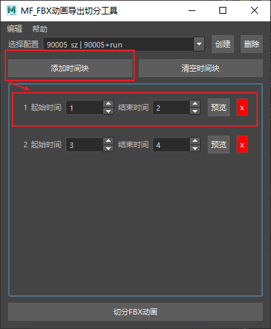
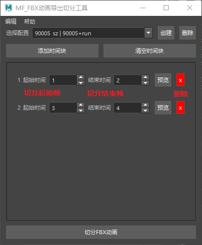
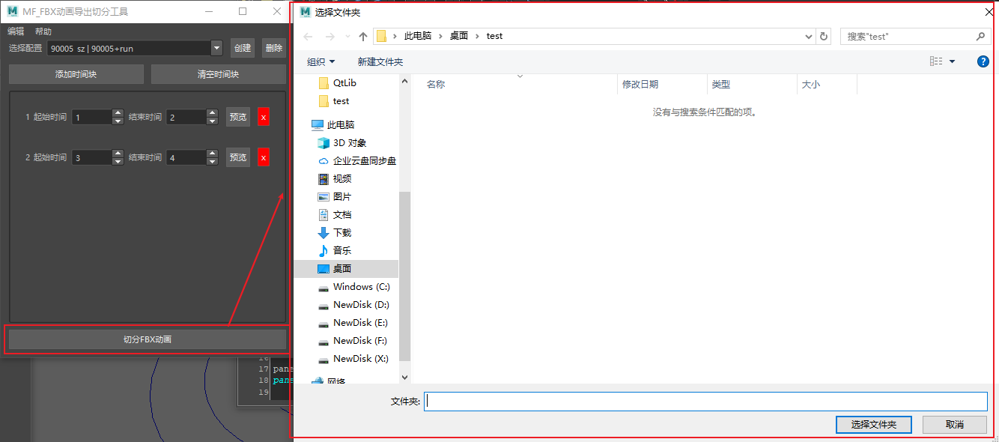

# 目录
- [启动](#%E5%90%AF%E5%8A%A8)
- [使用说明](#%E4%BD%BF%E7%94%A8%E8%AF%B4%E6%98%8E)
    - [配置操作](#%E9%85%8D%E7%BD%AE%E6%93%8D%E4%BD%9C)
    - [切分添加](#%E5%88%87%E5%88%86%E6%B7%BB%E5%8A%A0)

## 启动

> &emsp;&emsp;点击图标打开窗口

> &emsp;&emsp;点击可以打开窗口

## 使用说明

### 配置操作

> &emsp;&emsp;选择配置可以查询目前已经有的角色配置

> &emsp;&emsp;在输入框上进行输入也可以快速过滤出想要查找的角色

---

> &emsp;&emsp;点击创建按钮会弹出窗口给新的配置命名

> &emsp;&emsp;点击删除按钮可以彻底删除配置

### 切分添加

> &emsp;&emsp;点击添加时间块按钮会添加一个带有起始时间和结束时间的时间块

> &emsp;&emsp;红色 x 按钮可以删除当前时间块
> &emsp;&emsp;预览按钮可以自动播放当前切分的动画，再次点击就可以取消预览。

---

> &emsp;&emsp;点击切分FBX动画按钮 弹出目录选择窗口
> &emsp;&emsp;选择路径之后会更具时间块的数据进行 FBX 导出
